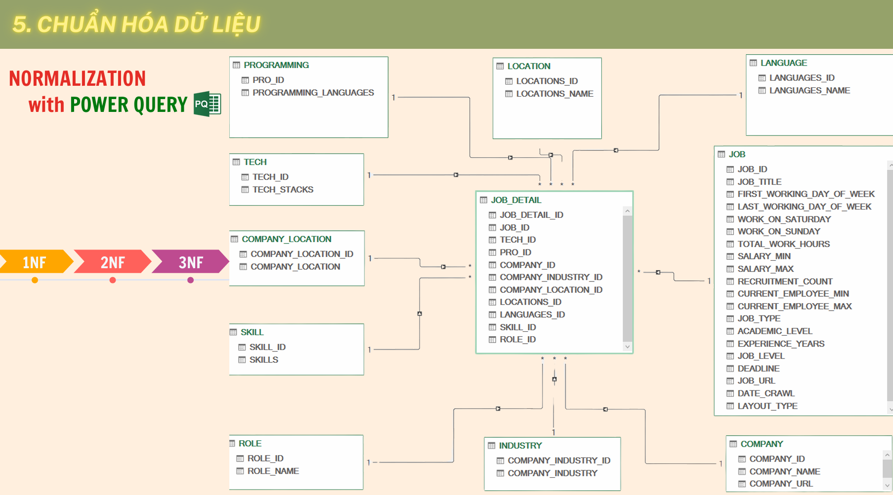
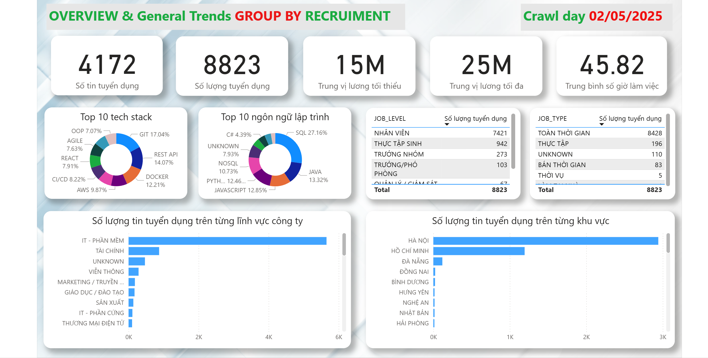
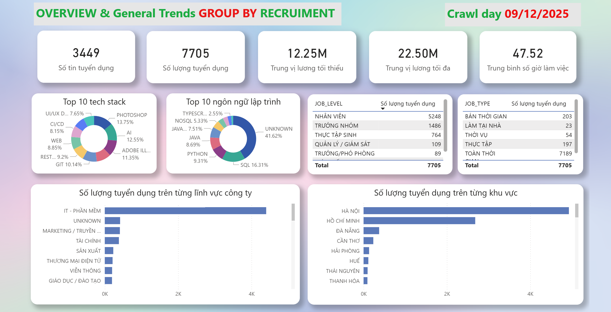

# Thu thập dữ liệu và phân tích xu hướng chuyển dịch tuyển dụng ngành ICT tại Việt Nam

## Tổng quan Dự án

Dự án này triển khai quy trình thu thập và xử lý dữ liệu tự động (Automated Data Pipeline) nhằm phân tích xu hướng tuyển dụng ngành Công nghệ thông tin tại Việt Nam. Hệ thống áp dụng kiến trúc Medallion để quản lý dữ liệu và sử dụng Mô hình ngôn ngữ lớn (Gemini 2.5 Pro) để trích xuất thông tin chuyên sâu từ các tin tuyển dụng phi cấu trúc.

## Phạm vi & Kế thừa:

- Dự án tập trung chuyên sâu vào phân tích sự chuyển dịch của thị trường lao động giữa hai mốc thời gian.

- Bộ dữ liệu quá khứ (Tháng 5/2025) được kế thừa và phát triển từ đồ án trước của nhóm: Phân tích xu hướng tuyển dụng ngành ICT tại Việt Nam và đề xuất hệ thống khuyến nghị việc làm. [Xem tại đây](https://github.com/DieppDiepp/DS108)

## Dashboard Báo cáo

* **Dữ liệu Hiện tại (Tháng 12/2025):** [Xem Dashboard trực tuyến tại đây](https://app.powerbi.com/view?r=eyJrIjoiMTliOGIwZmYtOTU5ZS00NmJhLTg3MjctY2IxMjQzYzRkN2Q2IiwidCI6IjY5MDRhYjJkLTlhZjQtNDNlOS05ODlmLTY1Mzg1NWEyODcyYSIsImMiOjEwfQ%3D%3D&pageName=cdf134563cba282b2804&fbclid=IwY2xjawO2F-VleHRuA2FlbQIxMABicmlkETEzdVhMcnMyazJPaUpKVDFBc3J0YwZhcHBfaWQQMjIyMDM5MTc4ODIwMDg5MgABHsFAaUyeWvxloxaUitIpDbOzvAxM8OU83sD1fmwc4W0B55E8wYi8b0tmjuh5_aem_ilAu0feeVbJYdM4vNjQFbQ)
* **Dữ liệu Quá khứ (Tháng 05/2025):** [Xem Dashboard trực tuyến tại đây](https://app.powerbi.com/view?r=eyJrIjoiYzEzZDc5ZWQtNjM1Yy00NTBhLTkwNTEtOTBiOGFlMDczMzQ0IiwidCI6IjY5MDRhYjJkLTlhZjQtNDNlOS05ODlmLTY1Mzg1NWEyODcyYSIsImMiOjEwfQ%3D%3D&pageName=ReportSection)

## Lý do thực hiện


## Điểm nổi bật về Kỹ thuật

Dự án tập trung giải quyết các bài toán về tổ chức dữ liệu lớn và vượt qua rào cản thu thập dữ liệu tự động:

* **Kiến trúc Medallion:** Dữ liệu được tổ chức nghiêm ngặt qua 3 tầng: Bronze (Raw) -> Silver (Cleaned/Augmented) -> Gold (Business Aggregates) giúp đảm bảo tính toàn vẹn và khả năng truy vết.
* **Quy trình Cào dữ liệu chuẩn CI/CD:** Hệ thống Crawler được thiết kế để chạy trên môi trường tích hợp liên tục, hỗ trợ chạy đa luồng trên nhiều máy ảo (Multi-VM) để tăng tốc độ.
* **Cơ chế Anti-Bot nâng cao:** Tích hợp Local Selenium Browser với các thuật toán tự động ngủ (auto-sleep), cơ chế thử lại (retry logic) và khả năng khôi phục phiên làm việc (resume capability) để vượt qua các lớp bảo mật Cloudflare checkbot mà không bị chặn IP.
* **Trích xuất thông tin bằng LLM:** Sử dụng API Gemini 2.5 Pro với kỹ thuật Few-shot prompting và xử lý đa luồng để cấu trúc hóa các dữ liệu văn bản tự do (mô tả công việc) thành dữ liệu dạng bảng.

## Cấu trúc Repository

```text
analysis-job-trend/
├── data/
│   ├── 1-Crawling_and_Scraping/   # Dữ liệu thô được lưu dưới cấu trúc JSON (Bronze Layer)
│   ├── 2-API-processing/          # Dữ liệu sau khi trích xuất qua Gemini
│   ├── 3-Postprocessing/          # Dữ liệu đã làm sạch và xử lý logic (Silver Layer)
│   ├── 4-Normalization/           # Dữ liệu đã chuẩn hóa hoàn chỉnh cho BI (Gold Layer)
│   └── 5-Data-Training/           # Dữ liệu sử dụng để xây dựng mô hình dự đoán lương
├── src/
│   ├── crawling/                  # Mã nguồn Selenium & Logic vượt Cloudflare
│   ├── information_extraction/    # Mã nguồn gọi API Gemini & Prompting
│   └── training_model/            # Mã nguồn biến đổi dữ liệu
├── Data_Description.md            # Mô tả các bảng trong lược đồ cơ sở dữ liệu 
├── requirements.txt 
└── .gitignore

```

## Thiết kế Cơ sở dữ liệu

Dữ liệu lớp Gold được mô hình hóa theo dạng Star Schema chuẩn hóa cấp 3 (3NF) để tối ưu hiệu năng truy vấn cho Power BI.



## Trực quan hóa dữ liệu

Dưới đây là hình ảnh demo một trang tổng quan từ Dashboard của hai mốc thời gian (Dashboard thực tế bao gồm nhiều trang phân tích chi tiết).




## Kết quả Dự án

### Kết quả Xây dựng Hệ thống

* Hoàn thiện Pipeline thu thập, trích xuất và chuẩn hóa dữ liệu tự động từ đầu đến cuối.
* Xây dựng thành công bộ dữ liệu chuẩn "Silver" bao gồm 3,449 bản ghi tuyển dụng chất lượng cao.
* Thiết kế kiến trúc lưu trữ Star Schema phù hợp cho phân tích đa chiều.

### Kết quả Phân tích Thị trường

Kết quả so sánh dữ liệu cho thấy thị trường ICT Việt Nam đang trong giai đoạn "thanh lọc" và tái cấu trúc mạnh mẽ:

* **Thị trường thu hẹp:** Quy mô tuyển dụng giảm 17.3%, mức lương trung vị tối thiểu giảm 18.3%.
* **Cấu trúc nhân sự "Viên kim cương":** Cắt giảm mạnh nhân sự cấp nhân viên/thực thi, tập trung tuyển dụng vị trí Trưởng nhóm (Team Leader) và quản lý cấp trung có khả năng kiêm nhiệm (Working Managers).
* **Công nghệ:** AI vươn lên Top 3 kỹ năng bắt buộc, thay thế các kỹ năng hạ tầng cũ (AWS, Docker). Nhóm kỹ năng Sáng tạo/UI-UX lên ngôi.
* **Thực dụng hóa bằng cấp:** Doanh nghiệp ưu tiên hiệu quả chi phí, dẫn đến nhu cầu tuyển dụng nhân sự trình độ Cao đẳng tăng 27% cho các vị trí vận hành, trong khi yêu cầu đối với trình độ Đại học giảm.